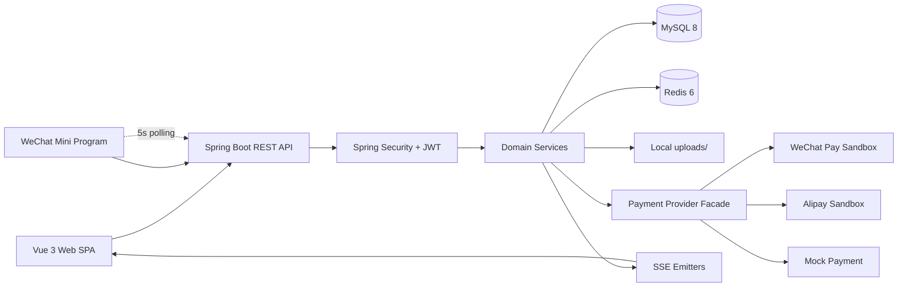
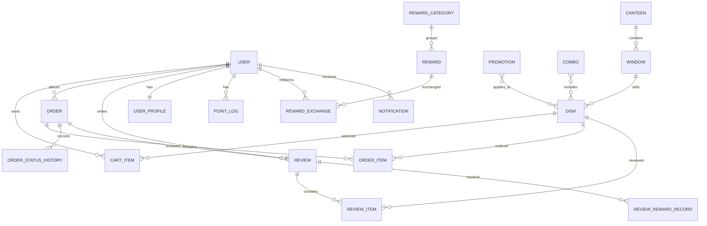
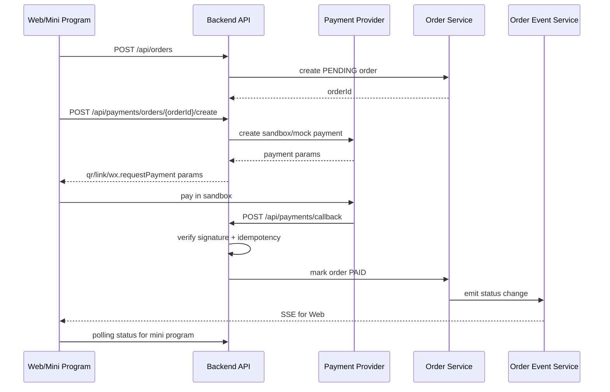
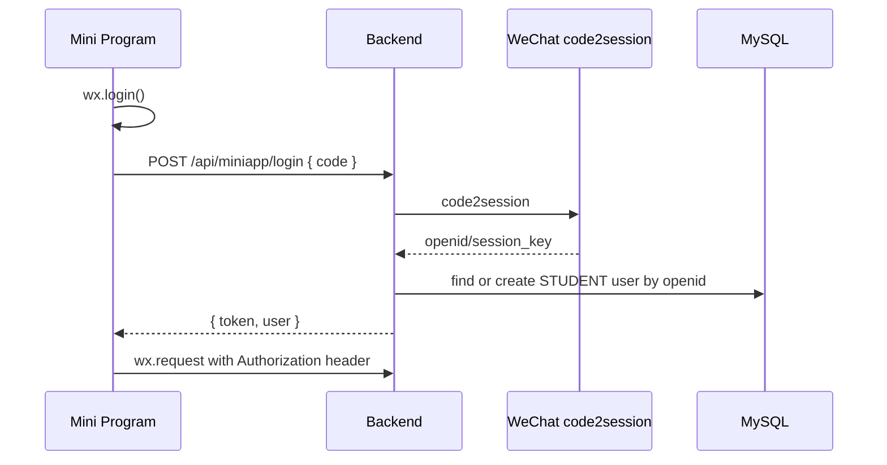

# System Architecture: 校园食堂智能推荐系统

**Document Version:** 1.0  
**Date:** 2026-05-17  
**Author:** System Architect (BMAD Method v6)  
**Status:** Draft  
**Input:** `docs/prd-canteen-recommendation-2026-05-17.md`, `docs/product-brief-canteen-recommendation-2026-05-17.md`, current codebase

---

## 1. System Overview

### 1.1 Purpose

校园食堂智能推荐系统是一套面向高校食堂场景的多端点餐与运营分析系统。系统为学生提供浏览、推荐、购物车、下单、支付、订单状态、评价、积分兑换等闭环能力；为窗口管理员和系统管理员提供菜品、窗口、订单、促销、评价、公告、数据看板和高级分析能力。

当前阶段目标不是生产级校园 SaaS，而是把现有毕业设计项目升级为可演示、可解释、可交付的作品集系统。架构设计优先服务 2026-05-23 前的短周期交付，保留后续生产化演进路径。

### 1.2 Scope

**In Scope**

- Web 学生端与管理后台：Vue 3、Element Plus、Pinia、vue-router、ECharts。
- 后端 REST API：Spring Boot 3、Spring Security、Spring Data JPA、MySQL、Redis。
- 三类角色：`STUDENT`、`WINDOW_MANAGER`、`ADMIN`。
- 点餐闭环：菜品浏览、购物车、订单、订单状态流转、SSE 状态推送、评价、积分兑换。
- 推荐引擎：协同过滤、内容、上下文、热门、融合推荐、健康目标推荐、推荐理由。
- 数据分析：Dashboard、趋势、排行、评价 NLP、词云、关联规则、用户分群、异常检测、库存预警、Excel 导出。
- 新增增量：第三方支付沙箱 / mock 兜底、微信小程序学生端、跨端共用后端 API。

**Out of Scope**

- KDS、叫号屏、打印机、刷脸取餐等门店硬件集成。
- 供应链、进货批次、保质期、财务对账等深库存与财务域。
- iOS / Android 原生 App。
- 多租户 SaaS、计费、跨学校隔离。
- 高可用多机房部署和大规模微服务治理。

### 1.3 Architectural Drivers

| Driver | Source | Architectural Impact |
|---|---|---|
| NFR-001 接口响应 | 非聚合接口 95% < 200ms，聚合统计 < 1s | 保留 Redis 缓存、数据库索引、分页查询；聚合接口单独优化 |
| NFR-002 首屏性能 | 登录后 LCP < 2.5s，关键交互 < 100ms | 前端懒加载、API 模块化、图表按需加载、静态资源构建优化 |
| NFR-003 鉴权与密码 | JWT + RBAC，BCrypt，secret 环境变量覆盖 | Spring Security FilterChain、JWT Filter、路由守卫、角色元信息一致 |
| NFR-004 支付回调安全 | 签名校验、重复回调幂等 | Payment Facade、签名验证、幂等键、订单状态机约束 |
| NFR-006 演示模式 | 数据稀疏时图表非空 | 前端 demo 开关 + 后端 mock 数据集，保证看板可演示 |
| NFR-007 前端可维护 | 统一 `vue/src/api`、`VITE_API_BASE`、Pinia 收口 | API client 单一入口、组件拆分、状态持久化策略 |
| NFR-009 多端协同 | Web / 小程序共用 API，统一 JWT Header | 后端无 Cookie 依赖；小程序 request 封装复用鉴权协议 |
| NFR-010 实时与降级 | Web SSE，小程序 5s 短轮询 | 订单状态事件服务 + 小程序轮询接口 |
| NFR-012 本地可启动 | 30 分钟内完整本地启动 | 单体后端、单库、单 Redis、本地上传目录、SQL 初始化脚本 |

### 1.4 Stakeholders

| Stakeholder | Concern |
|---|---|
| 作者 / 开发者 | 短周期可交付、代码可解释、作品集可展示 |
| 面试官 / 评审 | 架构清晰、技术选型合理、核心路径可演示 |
| 学生 | 点餐效率、推荐解释、订单状态及时反馈 |
| 窗口管理员 | 订单流转、菜品与促销维护、差评响应 |
| 系统管理员 | 全局管理、数据看板、运营分析 |

---

## 2. Architecture Pattern

### 2.1 Selected Pattern

**Pattern:** 前后端分离的模块化单体（Modular Monolith）+ 分层架构。

```text
Vue Web SPA / WeChat Mini Program
              |
              | HTTP REST / SSE / Polling
              v
Spring Boot Modular Monolith
  Controller -> Service -> Repository -> Entity
              |
              +---- MySQL 8
              +---- Redis 6
              +---- Local File Storage
              +---- Payment Sandbox / Mock Provider
```

### 2.2 Justification

- 项目是 Level 3 复杂集成，但当前团队为单人短周期交付，微服务会显著增加部署、联调、事务和观测成本。
- 业务域可以按模块拆分，但大部分事务仍围绕订单、支付、评价、积分，单体内事务一致性更直接。
- 当前本地演示约束要求 30 分钟内从零启动，单体后端 + 单 MySQL + 单 Redis 更符合目标。
- 模块化边界仍然清晰：用户认证、商品与食堂结构、购物车订单、支付、推荐、评价积分、统计分析、通知公告、文件上传。

### 2.3 Alternatives Considered

| Option | Decision | Reason |
|---|---|---|
| Microservices | Rejected for this iteration | 运维复杂度、分布式事务、接口治理成本超出短周期收益 |
| Serverless | Rejected | SSE、JPA 事务、本地演示和支付回调调试不匹配 |
| BFF per client | Deferred | Web 与小程序当前功能重合度高，统一 REST API 更节省成本 |
| Native mobile app | Out of scope | PRD 明确仅做微信小程序 |

### 2.4 Module Boundaries

后端保持同一 Spring Boot 应用，但按业务模块维护服务边界：

- `auth-user`: 登录、注册、JWT、用户资料、RBAC。
- `catalog`: 食堂、窗口、菜品、分类、套餐、促销。
- `ordering`: 购物车、下单、订单状态机、SSE。
- `payment`: 支付创建、沙箱 / mock、回调、验签、状态查询。
- `recommendation`: 多策略推荐、融合、健康目标、推荐理由。
- `review-points`: 评价、评价项、差评预警、积分流水、兑换。
- `analytics`: Dashboard、高级分析、Excel 导出。
- `notification-announcement`: 用户通知、管理员预警、系统公告。
- `file`: 图片上传与静态资源访问。
- `miniapp`: 微信登录适配、`wx.requestPayment` 参数适配、小程序轮询策略。

---

## 3. Component Design

### 3.1 Runtime Component View



### 3.2 Frontend Web SPA

**Responsibilities**

- 学生端与管理后台 UI。
- 路由守卫、角色控制、API 调用、全局错误提示。
- 推荐理由、看板图表、管理表格、订单状态等用户体验。

**Current Implementation**

- `vue/src/router/index.js`: route meta includes `requiresAuth`, `requiresAdmin`, `allowedRoles`。
- `vue/src/api/index.js`: Axios instance with token injection and error handling。
- `vue/src/stores/user.js`: user state store。
- `vue/src/views/*` and `vue/src/views/admin/*`: student and admin pages。
- `vue/src/components/admin/*`: chart and advanced analysis components。

**Architecture Decisions**

- API client must move from hardcoded `http://localhost:8089` to `import.meta.env.VITE_API_BASE` to satisfy NFR-007。
- Role checking should converge on Pinia getters and router meta, avoiding duplicated `localStorage` reads.
- ECharts and advanced panels should be lazy loaded to keep LCP under 2.5s.

### 3.3 WeChat Mini Program Client

**Responsibilities**

- Student main path: login, browse dishes, recommendation, cart, order, payment, order detail, review, points mall.
- Use `wx.login` and backend `code2session` adapter for silent login.
- Use `wx.request` wrapper with `Authorization: Bearer <token>`.
- Use `wx.requestPayment` for payment launch.
- Use 5s polling on order detail instead of SSE.

**Architecture Decisions**

- No Taro / Uni-app in this iteration; native mini program reduces framework migration cost.
- Reuse backend REST resources where possible; only add miniapp-specific auth and payment parameter endpoints.
- Keep mini program token independent from Web token to avoid cross-device state coupling.

### 3.4 API and Security Layer

**Responsibilities**

- REST resource routing, request validation, JWT authentication, RBAC authorization, CORS.
- Uniform error contract via `GlobalExceptionHandler`.

**Current Implementation**

- `SecurityConfig` permits login/register and public read APIs, protects writes and `/api/admin/**`.
- `JwtAuthenticationFilter` injects authenticated user context.
- `BCryptPasswordEncoder` protects passwords.

**Architecture Decisions**

- All state-changing APIs require JWT except payment callback.
- Payment callback is public at the transport layer but must pass provider signature verification.
- CORS should allow local development and documented mini program domains; production should replace wildcard-like local patterns.

### 3.5 Catalog Module

**Responsibilities**

- Canteen, window, dish, combo and promotion management.
- Student browsing, search, category filtering, sorting, top-rated/popular/hot dishes.

**Interfaces**

- `/api/canteens/**`
- `/api/windows/**`
- `/api/dishes/**`
- `/api/combos/**`
- `/api/promotions/**`

**Data Owned**

- `Canteen`, `Window`, `Dish`, `Combo`, `Promotion`, `DailyDishStatistic`

**NFR Coverage**

- NFR-001: indexes on category, window, status, sales, rating fields.
- NFR-007 / NFR-008: `BigDecimal` for money; migrate legacy `Combo.price` if needed.

### 3.6 Ordering Module

**Responsibilities**

- Persistent cart, order creation, status transitions, order queries, cancellation, pickup confirmation, SSE events.

**Interfaces**

- `/api/orders/cart/**`
- `/api/orders`
- `/api/orders/{orderId}`
- `/api/orders/{orderId}/cancel`
- `/api/orders/{orderId}/prepare`
- `/api/orders/{orderId}/ready`
- `/api/orders/{orderId}/confirm-pickup`
- `/api/orders/events`

**Data Owned**

- `CartItem`, `Order`, `OrderItem`, `OrderStatusHistory`

**State Machine**

```text
PENDING -> PAID -> PREPARING -> READY -> COMPLETED
PENDING -> CANCELLED
PAID    -> CANCELLED
```

Invalid transitions return 400 and do not mutate data. Each transition writes `OrderStatusHistory` and emits order event for Web SSE; mini program reads the same state through polling.

### 3.7 Payment Module

**Responsibilities**

- Create payment order parameters.
- Switch between `mock` and `sandbox` providers.
- Verify callback signatures.
- Apply idempotent callback handling.
- Reconcile local order state with provider state.

**Target Interfaces**

- `POST /api/payments/orders/{orderId}/create`
- `POST /api/payments/callback`
- `GET /api/payments/orders/{orderId}/status`
- `POST /api/payments/orders/{orderId}/success` for controlled mock / demo fallback.

**Component Model**

```text
PaymentController
  -> PaymentApplicationService
     -> PaymentProviderFactory
        -> WeChatPaySandboxProvider
        -> AliPaySandboxProvider
        -> MockPaymentProvider
     -> PaymentSignatureVerifier
     -> OrderService.markPaid(...)
     -> OrderEventService.emit(...)
```

**NFR Coverage**

- NFR-004: signature verification, timestamp window, duplicate notification idempotency.
- NFR-006: mock mode guarantees demo continuity.
- NFR-011: payment lifecycle logs with provider, order id, callback id, verification result.

### 3.8 Recommendation Module

**Responsibilities**

- Personalized recommendations, strategy-specific recommendations, health goal recommendations, recommendation reasons.

**Interfaces**

- `/api/recommendations/personalized`
- `/api/recommendations/personalized/reasons`
- `/api/recommendations/strategy/{type}`
- `/api/recommendations/health`
- `/api/recommendations/health-goals`
- `/api/recommendations/discovery`
- `/api/recommendations/today-new`
- `/api/recommendations/today-personalized-hot`

**Current Pattern**

- `RecommendationStrategy` interface.
- Strategy implementations: collaborative filtering, content-based, context-aware, popularity.
- `RecommendationServiceImpl` orchestrates fusion.

**NFR Coverage**

- NFR-005: new strategy classes should be auto-discovered by Spring.
- NFR-001: cache recommendation result by user, strategy and health goal; invalidate after order creation or profile change.

### 3.9 Review, Points and Voucher Module

**Responsibilities**

- Review creation with images and review items.
- Admin replies, negative review warnings.
- Review reward event, points ledger, reward exchange, voucher management.

**Interfaces**

- `/api/reviews/**`
- `/api/points/**`
- `/api/rewards/**`
- `/api/admin/rewards/**`
- `/api/admin/vouchers/**`
- `/api/admin/voucher-exchanges/**`

**Data Owned**

- `Review`, `ReviewItem`, `ReviewRewardRule`, `ReviewRewardRecord`, `PointLog`, `Reward`, `RewardCategory`, `RewardExchange`

**Key Decision**

Review reward uses a domain event (`ReviewCreatedEvent`) and listener (`ReviewRewardEventListener`) so review submission is not tightly coupled to points issuance logic.

### 3.10 Analytics Module

**Responsibilities**

- Dashboard metrics, trend, ranking, category analysis, review keywords, dish features word cloud, association rules, user segmentation, anomaly detection, comparison analysis, inventory warnings, Excel export.

**Interfaces**

- `/api/statistics/**`
- `/api/dishes/export`
- `/api/orders/export`
- `/api/reviews/export`
- `/api/users/export`

**Architecture Decisions**

- Keep analytics inside the monolith for current data scale (<10k orders).
- Use SQL/JPA aggregation and cache expensive query results.
- Use front-end demo switch to show mock charts when real data is sparse.
- Use EasyExcel for export.

### 3.11 Notification and Announcement Module

**Responsibilities**

- User notifications, admin warnings, unread counts, system announcements.

**Interfaces**

- `/api/notifications/**`
- `/api/announcements`
- `/api/admin/announcements/**`

**Architecture Decisions**

- Keep notifications persisted in MySQL.
- Use 30s polling for unread counts in Web admin nav.
- Use order SSE only for order state where timeliness matters.

---

## 4. Data Model

### 4.1 Core Entity Relationship



### 4.2 Entity Groups

| Group | Entities | Notes |
|---|---|---|
| Identity | `User`, `UserProfile` | role, password hash, status, profile preferences |
| Catalog | `Canteen`, `Window`, `Dish`, `Combo`, `Promotion`, `DailyDishStatistic` | food hierarchy and promotional data |
| Order | `CartItem`, `Order`, `OrderItem`, `OrderStatusHistory` | transactional order lifecycle |
| Feedback | `Review`, `ReviewItem` | order-level and dish-level review detail |
| Rewards | `PointLog`, `ReviewRewardRule`, `ReviewRewardRecord`, `Reward`, `RewardCategory`, `RewardExchange` | ledger and voucher exchange |
| Operations | `Notification`, `SystemAnnouncement` | message and public announcement |

### 4.3 Storage Strategy

| Storage | Usage | Decision |
|---|---|---|
| MySQL 8 | transactional business data | ACID needed for orders, points, voucher exchange and payment state |
| Redis 6 | recommendation cache, hot query cache, optional session-like ephemeral data | supports NFR-001 and avoids repeated expensive recommendation work |
| Local uploads directory | review images and dish assets during local demo | simplest for local delivery; production should migrate to object storage |
| SQL script | seed and demo dataset | supports NFR-012 local startup |

### 4.4 Indexing Recommendations

- `users.student_id`, `users.username`, `users.role`, `users.status`
- `dishes.window_id`, `dishes.category`, `dishes.status`, `dishes.rating`, `dishes.sales_count`
- `orders.order_no`, `orders.user_id`, `orders.status`, `orders.create_time`
- `order_items.order_id`, `order_items.dish_id`
- `reviews.user_id`, `reviews.order_id`, `reviews.status`, `reviews.rating`
- `notifications.user_id`, `notifications.is_read`, `notifications.scene`, `notifications.create_time`
- `point_logs.user_id`, `point_logs.create_time`
- `reward_exchanges.user_id`, `reward_exchanges.status`, `reward_exchanges.request_id`

---

## 5. API Specifications

### 5.1 API Style

| Item | Decision |
|---|---|
| Protocol | HTTP REST; SSE only for Web order events |
| Auth | `Authorization: Bearer <JWT>` |
| Authorization | URL-level RBAC in Spring Security + method/service checks for ownership |
| Response shape | Existing controllers may vary; new APIs should standardize `{ code, message, data }` or documented raw object |
| Versioning | Current `/api/**`; add `/api/v2/**` only if breaking changes become unavoidable |
| Error handling | `GlobalExceptionHandler` returns consistent message/code/status |

### 5.2 Endpoint Groups

| Group | Endpoint Prefix | Auth |
|---|---|---|
| Auth/User | `/api/users/**` | login/register public; others JWT |
| Catalog | `/api/dishes/**`, `/api/canteens/**`, `/api/windows/**`, `/api/combos/**`, `/api/promotions/**` | public GET, manager/admin write |
| Cart/Order | `/api/orders/**`, `/api/orders/cart/**` | JWT |
| Payment | `/api/payments/**` | JWT except callback |
| Recommendation | `/api/recommendations/**` | public or JWT depending personalization; personalized should prefer JWT |
| Review | `/api/reviews/**` | read mixed; write JWT |
| Points/Rewards | `/api/points/**`, `/api/rewards/**` | JWT |
| Admin | `/api/admin/**` | `ADMIN` or `WINDOW_MANAGER`, with finer route restrictions |
| Analytics | `/api/statistics/**` | JWT; admin-only for sensitive panels recommended |
| Notification | `/api/notifications/**` | JWT |
| Announcement | `/api/announcements`, `/api/admin/announcements/**` | public read, admin write |
| Upload | `/api/upload` | JWT recommended |

### 5.3 Payment Flow



### 5.4 Mini Program Auth Flow



---

## 6. Non-Functional Requirements Mapping

| NFR ID | Category | Requirement | Architectural Decision | Status |
|---|---|---|---|---|
| NFR-001 | Performance | 95% non-aggregate API < 200ms; aggregate < 1s | Redis cache, database indexes, pagination, query-specific aggregation | Addressed |
| NFR-002 | Frontend performance | LCP < 2.5s, interactions < 100ms | lazy routes, ECharts lazy load, API moduleization, avoid synchronous heavy chart work | Addressed with required refactor |
| NFR-003 | Security | JWT + RBAC + BCrypt + env secret | Spring Security, JWT filter, BCrypt, env config | Addressed |
| NFR-004 | Payment security | callback signature and idempotency | payment facade, signature verifier, callback idempotency key, order state machine | Target design |
| NFR-005 | Extensibility | pluggable recommendation strategy | `RecommendationStrategy` interface and Spring strategy implementations | Addressed |
| NFR-006 | Demo availability | charts non-empty under sparse data | demo switch + mock dataset + frontend fallback | Target design |
| NFR-007 | Frontend maintainability | unified API/client/state | `vue/src/api`, `VITE_API_BASE`, Pinia as single state source | Partially addressed; refactor required |
| NFR-008 | Backend maintainability | `BusinessException`, current user helper, `BigDecimal` | global exception handler, `SecurityUtils`, monetary type rules | Partially addressed |
| NFR-009 | Multi-client compatibility | Web/mini program share backend, JWT header | stateless REST API, CORS/domain config, miniapp request wrapper | Target design |
| NFR-010 | Reliability | SSE reconnect and miniapp polling | SSE for Web, 5s polling on miniapp order detail | Addressed / target |
| NFR-011 | Observability | logs and friendly error responses | global exception handler, payment/recommendation logs, Axios error mapping | Addressed with enhancements |
| NFR-012 | Local startup | 30-minute local setup | single backend, MySQL, Redis, SQL seed, README/docker-compose path | Target design |

---

## 7. Technology Stack

### 7.1 Frontend

| Technology | Version / Usage | Rationale |
|---|---|---|
| Vue | 3.3.x | Existing codebase, quick iteration, composition-friendly UI |
| Vite | current project config | fast local dev and build |
| Element Plus | 2.3.x | admin tables/forms/dialogs fit management backend |
| Pinia | 2.1.x | predictable state for auth/user/cart/demo mode |
| vue-router | 4.2.x | route-level auth and lazy loading |
| Axios | 1.5.x | central interceptors, token injection, error handling |
| ECharts / vue-echarts | 5.4.x / 6.6.x | dashboard, trend, word cloud and analytics visuals |

### 7.2 Backend

| Technology | Version / Usage | Rationale |
|---|---|---|
| Java | 17 | Spring Boot 3 baseline, stable LTS |
| Spring Boot | 3.3.13 | REST, JPA, validation, security ecosystem |
| Spring Security | current project dependency | JWT auth and RBAC |
| Spring Data JPA | current project dependency | rapid CRUD and transactional data access |
| MySQL Connector | 8.0.33 | MySQL 8 integration |
| Redis | Spring Data Redis | recommendation/hot data cache |
| JJWT | 0.11.5 | JWT creation and verification |
| EasyExcel | 3.3.2 | admin export |

### 7.3 Infrastructure

| Environment | Deployment |
|---|---|
| Development | local MySQL + Redis + Spring Boot `:8089` + Vite dev server |
| Demo | single VM or local machine; built Vue static files can be served by Nginx or Vite preview; backend jar runs separately |
| Production-ready path | Nginx static hosting, Spring Boot jar/container, managed MySQL, Redis, object storage for uploads |

---

## 8. Trade-off Analysis

### 8.1 Modular Monolith vs Microservices

**Decision:** Modular monolith.

**Benefit:** fast local startup, simpler transaction handling, lower deployment cost, easier demo.  
**Cost:** components scale together, module boundaries rely on discipline.  
**Mitigation:** keep service interfaces clean; avoid cross-module repository access except through service APIs.  
**Revisit when:** concurrent users or team size grows enough that recommendation, analytics or payment needs independent scaling.

### 8.2 Native Mini Program vs Cross-platform Framework

**Decision:** native WeChat Mini Program.

**Benefit:** direct `wx.login`, `wx.requestPayment`, lower tooling risk.  
**Cost:** cannot share Vue components with Web.  
**Mitigation:** share API contract and DTO shape; keep UI scope focused on student main path.  
**Revisit when:** mobile feature scope expands to multiple platforms.

### 8.3 SSE vs WebSocket

**Decision:** SSE for Web order events, polling for mini program.

**Benefit:** simpler server implementation, fits one-way order status updates.  
**Cost:** no bidirectional channel, mini program needs polling.  
**Mitigation:** restrict mini program polling to order detail page at 5s interval.  
**Revisit when:** kitchen display, chat, live queueing or bidirectional operations are added.

### 8.4 Payment Sandbox + Mock Fallback

**Decision:** support sandbox provider and mock provider behind a facade.

**Benefit:** protects demo continuity when merchant credentials or sandbox connectivity fail.  
**Cost:** mock path may hide provider-specific edge cases.  
**Mitigation:** keep callback verification and idempotency logic shared; document mode clearly in README.  
**Revisit when:** production money movement becomes in scope.

### 8.5 JPA `ddl-auto=update` vs Migration Tool

**Decision:** keep `ddl-auto=update` for short-cycle local demo; recommend Flyway/Liquibase for production path.

**Benefit:** fast schema iteration.  
**Cost:** schema drift and unreviewed database changes.  
**Mitigation:** keep `canteen_recommendation.sql` as seed baseline and document production migration path.  
**Revisit when:** deploying beyond local demo or adding collaborators.

---

## 9. Deployment Architecture

### 9.1 Local Demo

```text
Developer Machine
  - MySQL 8: canteen_recommendation
  - Redis 6: localhost:6379
  - Spring Boot API: localhost:8089
  - Vue dev server: localhost:5173
  - WeChat DevTools: mini program connects to localhost or configured LAN/domain
  - uploads/: local file directory
```

### 9.2 Single Server Demo

```text
Browser / WeChat DevTools
       |
       v
Nginx
  - / -> Vue static dist
  - /api -> Spring Boot :8089
  - /uploads -> local uploaded files
       |
       +--> Spring Boot Jar
              |
              +--> MySQL
              +--> Redis
```

### 9.3 Configuration

| Config | Source |
|---|---|
| API base URL | `VITE_API_BASE` |
| DB | `DB_URL`, `DB_USERNAME`, `DB_PASSWORD` |
| Redis | `REDIS_HOST`, `REDIS_PORT`, `REDIS_PASSWORD`, `REDIS_DB` |
| JWT | `JWT_SECRET`, `JWT_EXPIRATION` |
| Payment | `payment.mode`, provider app id / key / callback secret |
| Uploads | `FILE_UPLOAD_DIR` |
| Demo mode | URL query/store flag such as `?demo=1` |

---

## 10. Implementation Guidance

### 10.1 Required Before Sprint Planning

1. Confirm payment provider priority: WeChat first, Alipay optional if time remains.
2. Add explicit payment mode config: `mock | sandbox`.
3. Define mini program folder and request wrapper convention.
4. Decide whether Docker Compose is required for NFR-012 or README + SQL is enough.

### 10.2 Engineering Rules

- New backend write APIs must enforce current user via security context, not request user id alone.
- New money fields use `BigDecimal`, never `double`.
- New front-end API calls must go through `vue/src/api`.
- New cross-client APIs must not rely on Cookie/Session.
- Order, payment and points mutations must be idempotent where repeated client/provider calls are likely.
- Analytics mock data must be visibly marked by mode in code/config, but UI should not require the user to understand the implementation.

---

## 11. Future Considerations

| Horizon | Evolution |
|---|---|
| Near term | `VITE_API_BASE`, Pinia auth cleanup, payment facade, mini program auth/payment, demo data switch |
| Medium term | Flyway/Liquibase, object storage for uploads, OpenAPI docs, integration tests for order/payment/reward |
| Long term | extract recommendation/analytics as independent services if traffic or compute cost grows; add Prometheus/Grafana; introduce CDN and managed DB |

---

## Appendix A: Requirement Coverage

| Requirement Area | Architecture Coverage |
|---|---|
| FR-001~003 User/Auth/RBAC | API and Security Layer, Frontend Web SPA |
| FR-004~006 Catalog | Catalog Module |
| FR-007~010 Cart/Order/SSE | Ordering Module |
| FR-011~013 Payment | Payment Module |
| FR-014~016 Review/Points | Review, Points and Voucher Module |
| FR-017~020 Recommendation | Recommendation Module |
| FR-021~023 Analytics/Export | Analytics Module |
| FR-024~025 Notification/Announcement | Notification and Announcement Module |
| FR-026~028 Mini Program | WeChat Mini Program Client, Mini Program Auth Flow |

## Appendix B: References

- PRD: `docs/prd-canteen-recommendation-2026-05-17.md`
- Product Brief: `docs/product-brief-canteen-recommendation-2026-05-17.md`
- Backend entry: `java/src/main/java/com/school/canteen/CanteenOrderingApplication.java`
- Frontend entry: `vue/src/main.js`
- Database seed: `canteen_recommendation.sql`
- BMAD status: `docs/bmm-workflow-status.yaml`

---

**END OF DOCUMENT**
