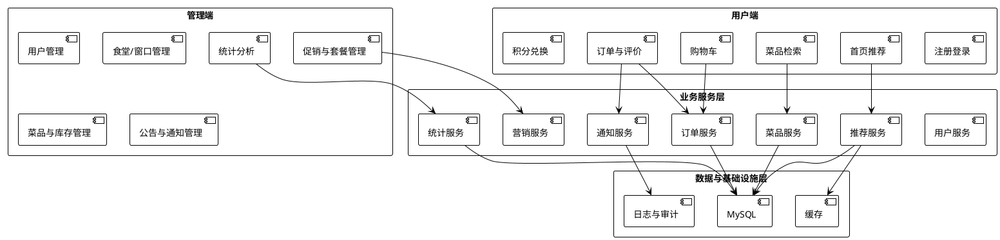
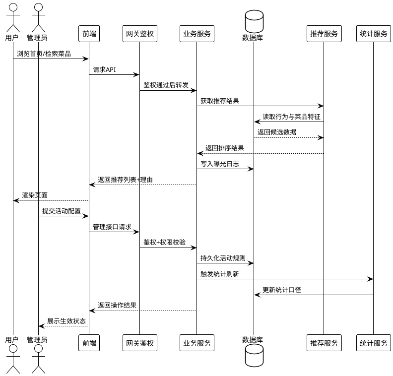
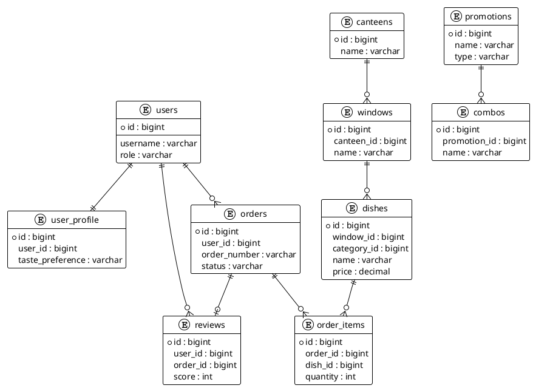
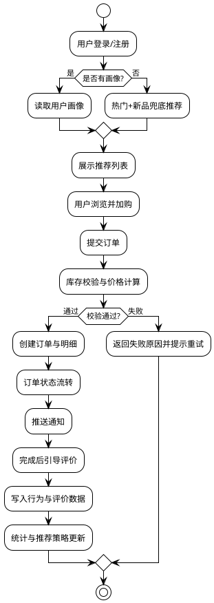

# 第三章 系统分析与设计

## 3.0 章节引言

本章以“校园食堂智能推荐系统”为研究对象，围绕系统建设过程中最关键的四个问题展开：系统要解决什么问题（需求分析）、系统由哪些模块组成（功能结构设计）、数据如何组织与支撑业务（数据库设计）、核心链路如何闭环运行（业务流程设计）。与传统只关注“菜品展示+下单”的订餐系统相比，本课题系统在功能目标上更强调“推荐准确性、运营可观测性与业务可持续迭代能力”，因此在分析与设计阶段不仅要覆盖常规业务，还需要面向推荐算法、用户画像、运营反馈和性能保障进行体系化设计。

本项目采用前后端分离架构，前端基于 Vue 生态完成用户端与管理端页面交互，后端基于 Spring Boot 构建 RESTful 服务，并结合 MySQL 存储业务数据。系统在能力边界上包含了用户管理、食堂与窗口管理、菜品管理、购物车与订单管理、评价与消息通知、营销活动、积分与兑换、统计分析、个性化推荐等模块。为保证论文后续“系统实现”与“系统测试”章节能够建立在一致的工程语境上，本章将尽量用可落地、可验证、可扩展的方式描述设计决策与技术理由。

---

## 3.1 需求分析

需求分析的目标不是简单罗列功能点，而是将校园就餐场景中的真实痛点转化为可实施的系统能力。在调研阶段，结合校园食堂高峰期体验、学生就餐决策习惯以及管理端运营诉求，可以归纳出三类核心矛盾：第一，用户在高峰时段“选择成本高”，经常出现“不知道吃什么、排队时间不透明、选择后不满意”的问题；第二，窗口与商户“供需匹配低效”，菜品曝光与真实口味偏好之间存在偏差；第三，平台侧“数据闭环不足”，缺少从推荐曝光到下单转化再到评价反馈的一体化链路，导致策略优化缺乏依据。

围绕上述矛盾，系统需要同时满足三类角色需求：普通用户关注效率与满意度，窗口管理者关注销量与运营效率，平台管理员关注平台稳定、安全与治理能力。系统需求因此被划分为功能性需求与非功能性需求两部分：前者回答“系统能做什么”，后者回答“系统做得怎么样”。

### 3.1.1 功能性需求

#### （1）用户端功能需求

1. **账号与身份能力**：支持注册、登录、退出、个人信息维护等基础能力；支持角色识别（普通用户、管理员、窗口管理员），保证不同角色访问边界明确。
2. **首页智能推荐**：基于用户历史行为、偏好标签、实时热度、时段特征生成个性化推荐卡片，支持“猜你喜欢”“热门推荐”“发现新菜”等推荐场景。
3. **菜品检索与筛选**：支持按食堂、窗口、类别、价格区间、口味标签、是否促销等多条件筛选，降低用户在高峰期的决策成本。
4. **购物车与下单**：支持加购、修改数量、套餐拆分、价格试算、下单、订单取消、订单状态跟踪等流程；下单时应考虑促销规则与库存校验。
5. **订单与评价闭环**：用户可在订单完成后对菜品评分与评价，评价信息可反向进入推荐系统用于后续优化。
6. **消息与提醒**：系统支持订单状态提醒、库存预警通知、平台公告、活动通知等消息触达能力，提升交互完整性。
7. **积分与兑换**：支持积分累计、积分日志查询、奖励兑换、兑换记录追踪，增强用户留存和平台运营能力。

#### （2）窗口/商户侧功能需求

1. **窗口信息管理**：支持窗口基础信息维护、营业状态管理、所属食堂与位置配置。
2. **菜品全生命周期管理**：支持菜品新增、编辑、上下架、库存更新、价格维护、图片上传、营养字段维护（热量、蛋白质、脂肪、碳水）等。
3. **促销活动管理**：支持创建活动、配置活动范围（菜品/分类）、折扣策略、活动时段；支持套餐管理与赠品处理。
4. **订单处理能力**：支持接单、制作、完成、异常处理与状态流转记录，保证后厨执行与前端展示一致。
5. **运营数据查看**：支持查看销量排行、评价趋势、库存预警、时段热度等运营指标，辅助窗口调整供给策略。

#### （3）平台管理端功能需求

1. **用户治理**：支持用户信息查询、角色授权、账号状态管理。
2. **内容与业务配置**：支持食堂、窗口、分类、公告等基础数据维护，保证平台信息一致性。
3. **推荐策略管理**：支持推荐策略切换与参数调整，包含热门策略、协同过滤策略、内容策略等组合方式。
4. **统计分析能力**：支持营收趋势、订单趋势、菜品排行、用户活跃时段、评价关键词、异常检测等分析视图。
5. **审计与追踪**：支持关键操作记录、订单状态历史追踪，为问题排查和责任追溯提供依据。

#### （4）推荐业务专项需求

1. **冷启动机制**：新用户缺乏历史行为时，可通过偏好配置与热门策略完成初始推荐；新菜品通过规则曝光进入候选池。
2. **多源特征融合**：推荐计算需融合行为特征（浏览、下单、评价）、内容特征（类别、口味、营养、价格）、上下文特征（时段、活动状态）。
3. **可解释推荐输出**：推荐结果应附带“推荐理由”，提升用户信任度与点击意愿。
4. **反馈闭环优化**：系统需记录推荐曝光、点击、转化、评价信号，用于后续策略评估与模型迭代。

### 3.1.2 非功能性需求

#### （1）性能需求

校园食堂业务具有明显“短时高并发”特征，尤其是午餐、晚餐高峰。系统应重点保障首页推荐、菜品列表、下单创建、订单查询等高频接口在并发场景下的响应稳定性。针对推荐接口可采用缓存与分层查询策略，针对统计接口可采用离线汇总或定时计算，避免复杂聚合影响在线链路。

#### （2）可靠性需求

订单链路必须具备事务一致性与异常补偿能力，避免出现重复扣库存、订单状态错乱、支付回调重复处理等问题。系统应为核心状态变更建立历史记录，并在关键接口实现幂等设计。对于通知、统计等非核心链路，应采用异步处理和失败重试机制，避免影响主交易路径。

#### （3）安全性需求

系统需要具备基础认证与授权能力，敏感接口必须进行身份校验和角色权限控制。密码等敏感信息应加密存储；管理端操作应可审计；关键接口应具备参数校验与限流机制，以降低恶意请求和越权访问风险。

#### （4）可用性需求

页面交互应保证操作路径短、反馈明确，特别是在移动端和弱网环境下需保持核心操作可完成。推荐模块应尽量减少“空列表”与“重复推荐”，并提供兜底结果，保证用户随时可用。

#### （5）可维护与可扩展需求

系统应遵循模块化设计，推荐模块、订单模块、营销模块、统计模块之间通过清晰接口交互，减少耦合。数据库结构应兼顾规范化与查询效率，为后续新增功能（如更精细的人群分层、更多营销玩法）预留扩展空间。

#### （6）兼容与部署需求

前端应兼容主流桌面浏览器与常见移动终端分辨率；后端应支持开发、测试、生产环境分离，并具备日志定位与快速回滚能力，降低上线风险。

#### （7）可度量质量目标

为了让非功能性需求具备可验收性，本课题在设计阶段给出可观测的质量目标：

1. 推荐与菜品列表接口在高峰期保持稳定响应，避免明显卡顿；
2. 下单与状态更新接口错误需可追踪、可重试，避免“无声失败”；
3. 管理端统计数据应具备统一口径，避免同一指标多处不一致；
4. 关键业务日志需覆盖“谁在何时对何数据做了什么操作”；
5. 对外展示数据与数据库落库数据之间应可核对，保障结果可信。

以上目标并非一次性完成，而是通过监控、日志、压测、回归测试逐步逼近。将质量目标前置到设计阶段，有助于避免“功能完成但系统不可运营”的常见问题。

---

## 3.2 系统功能结构设计

需求分析完成后，需要将“业务目标”映射为“系统结构”。本系统采用“分层架构 + 领域模块化”方式组织能力：前端负责交互与展示，后端负责业务编排与规则执行，数据层负责持久化与查询优化，推荐层负责候选召回与排序计算。该设计有两个直接收益：其一，业务模块可独立演进，降低迭代风险；其二，推荐策略可在不大改交易模块的前提下快速优化。

### 3.2.1 总体功能架构

系统总体功能由五个子域构成：

1. **用户域**：账号、画像、偏好、积分、通知。
2. **供给域**：食堂、窗口、菜品、分类、库存、营养信息。
3. **交易域**：购物车、订单、订单项、状态流转、支付结果。
4. **运营域**：促销活动、套餐、公告、评价激励、兑换规则。
5. **智能域**：推荐策略、推荐理由、统计分析、异常检测。

五个子域并非孤立：交易域为智能域提供真实转化信号，智能域反向提升供给域曝光效率，运营域通过活动策略影响用户行为，最终形成“推荐—交易—反馈—再优化”的连续闭环。

**图3-1 总体功能结构图（PlantUML）**

从架构职责上看，推荐服务并不直接替代业务逻辑，而是作为业务增强层：它在用户访问首页或详情页时输出更优排序结果；在推荐服务异常时可降级为热门/新品列表，避免影响主业务可用性。

### 3.2.2 前后端管理端设计

#### （1）前端设计

前端采用组件化开发，将页面拆分为导航、推荐卡片、图表、管理表单等独立组件。用户端重点优化“快速决策路径”，保证从进入首页到完成下单的交互步骤尽量短；管理端强调“批量操作效率与数据可视化”，例如通过图表组件展示菜品销量趋势、评价关键词与用户活跃时段。

#### （2）后端设计

后端采用分层组织：Controller 层负责请求入口与参数校验，Service 层负责业务规则与事务控制，Repository 层负责数据库访问。核心服务包括 RecommendationService、OrderService、DishService、PromotionService、StatisticsService、NotificationService 等，形成职责清晰的领域边界。

#### （3）接口协作与权限边界

系统通过统一 API 规范实现前后端协作，前端基于角色渲染权限菜单，后端基于角色进行接口访问控制。普通用户可访问查询、下单、评价等接口；管理员与窗口管理员具备管理能力。关键写操作（如下单、状态变更、活动配置）要求更严格的参数校验与审计记录。

#### （4）流程设计

用户请求流程大致为：前端发起请求 -> 后端认证与参数校验 -> 业务服务处理 -> 持久化与缓存更新 -> 返回统一响应。管理端流程增加了“配置生效与统计验证”环节，便于运营人员快速判断策略调整效果。

#### （5）管理端页面与能力映射

管理端不是单一后台页面，而是由“运营配置、交易治理、数据分析、系统治理”四类页面组成。其能力映射关系如下：

1. **运营配置页面**：对应食堂、窗口、菜品、活动、公告配置，目标是保证供给侧信息实时准确；
2. **交易治理页面**：对应订单管理、异常订单处理、状态历史追踪，目标是保证交易链路可控；
3. **数据分析页面**：对应营收趋势、菜品排行、用户时段活跃、评价关键词、异常检测，目标是支撑数据驱动决策；
4. **系统治理页面**：对应用户角色、消息通知、审计日志，目标是确保平台安全稳定运行。

这种映射方式可将“页面功能”直接对应到“治理目标”，便于后续章节展开实现与测试时进行逐项验证。

**图3-2 前后端流程设计（PlantUML）**

---

## 3.3 数据库设计

数据库设计是系统稳定运行与后续优化的基础。本项目以 MySQL 作为核心存储，采用“交易数据强一致、分析数据可汇总、推荐数据可追踪”的设计原则。数据库设计分为三层：概念模型设计（明确实体与关系）、逻辑结构设计（落实表结构与字段）、索引设计（保障查询性能）。

### 3.3.1 概念模型设计

结合系统功能与已有数据结构，核心实体可分为四组：

1. **用户与画像实体**：`users`、`user_profile`、`user_preferences`、`point_logs`。
2. **供给实体**：`canteens`、`windows`、`categories`、`dishes`、`dish_taste_tags`。
3. **交易实体**：`cart_items`、`orders`、`order_items`、`order_status_history`、`notifications`。
4. **运营与反馈实体**：`promotions`、`combos`、`combo_dishes`、`reviews`、`review_items`、`review_quick_tags`、`reward_exchanges`、`daily_dish_statistics`。

实体关系中最关键的是三条主链：

- **供给链**：食堂 -> 窗口 -> 菜品 -> 分类/口味标签。
- **交易链**：用户 -> 购物车 -> 订单 -> 订单项 -> 订单状态历史。
- **反馈链**：订单完成 -> 评价/评分 -> 统计汇总 -> 推荐策略优化。

上述链路决定了系统既可以支撑线上交易，又能够沉淀可用于推荐优化的行为数据。

**图3-3 ER图（PlantUML）**

### 3.3.2 逻辑结构设计

在逻辑结构层面，数据库采用“主业务表 + 关联表 + 汇总表”组合方式。主业务表保证交易一致性，关联表支撑多对多关系，汇总表提升统计查询效率。为保证论文可读性，以下给出核心表设计说明。

#### （1）用户与权限相关表

`users` 用于保存账号基础信息与角色；`user_profile` 存放用户画像信息（如健康目标、口味偏好）；`user_preferences` 存放可配置偏好项。该组数据服务于个性化推荐与权限校验。

#### （2）供给侧主数据表

`canteens`、`windows`、`categories`、`dishes` 构成菜品供给主链，`dish_taste_tags` 作为菜品口味标签补充。该组数据不仅用于列表展示，也用于内容推荐策略和筛选条件构建。

#### （3）交易与订单相关表

`cart_items` 保存用户当前待结算菜品；`orders` 保存订单主信息；`order_items` 保存订单明细；`order_status_history` 保存状态流转轨迹。该设计确保了从下单到完成全过程可追溯。

#### （4）运营活动与促销表

`promotions`、`promotion_dishes`、`promotion_dish_categories`、`combos`、`combo_dishes` 共同支撑促销与套餐玩法。价格计算时可按活动规则作用于菜品或分类，既支持灵活运营，也便于后续扩展新的优惠策略。

#### （5）反馈与激励表

`reviews`、`review_items`、`review_quick_tags` 记录评价主体与评价细粒度内容；`review_reward_rules`、`review_reward_records`、`reward_exchanges`、`rewards`、`reward_categories` 构建评价激励与积分兑换闭环。该闭环可以有效提升评价参与率与数据质量。

#### （6）统计与分析表

`daily_dish_statistics` 作为日粒度统计表，承载销量、库存预警等核心指标，减轻在线实时统计压力。该表支持管理端趋势图、异常提醒、运营决策等场景。

#### （7）核心表字段示例

| 表名 | 关键字段 | 设计要点 |
| --- | --- | --- |
| users | id, username, password, role, status | 角色驱动权限模型，状态字段支持账号治理 |
| dishes | id, window_id, category_id, price, status, calories | 同时满足展示、筛选与营养推荐需求 |
| orders | id, order_number, user_id, total_amount, status, create_time | 订单号唯一，状态机驱动流转 |
| order_items | id, order_id, dish_id, unit_price, quantity, subtotal | 保留交易时价格快照，避免后续价格变化影响对账 |
| reviews | id, user_id, order_id, score, content, create_time | 评价关联订单，保证评价可信来源 |
| promotions | id, name, type, start_time, end_time, status | 促销时效控制，便于运营调度 |
| point_logs | id, user_id, change_value, reason, create_time | 积分流水可审计，支持争议追踪 |

### 3.3.3 数据库索引设计

索引设计遵循“高频查询优先、写入成本可控、组合条件匹配”的原则。结合系统访问路径，可归纳为以下几类。

#### （1）唯一性与主键索引

1. 所有核心表使用主键索引作为聚簇入口，保证记录定位效率。
2. `users.username`、`orders.order_number` 等业务唯一字段建立唯一索引，避免重复数据。

#### （2）高频读场景索引

1. 菜品查询：`dishes(window_id, status)`、`dishes(category_id, status)`，用于窗口页与分类页快速筛选。
2. 用户订单：`orders(user_id, create_time)`，用于“我的订单”按时间倒序分页。
3. 订单状态检索：`orders(status, create_time)`，用于管理端按状态筛选。
4. 评价查询：`reviews(dish_id, create_time)`，用于菜品详情页加载评价。
5. 通知查询：`notifications(user_id, is_read, create_time)`，用于消息中心未读优先展示。

#### （3）关联与统计场景索引

1. `order_items(order_id)`、`order_items(dish_id)`，提高订单明细与销量统计查询效率。
2. `daily_dish_statistics(statistic_date, dish_id)`，支撑日趋势统计与预警聚合。
3. `point_logs(user_id, create_time)`，支持积分流水历史查询。

#### （4）索引与SQL协同优化策略

1. 对高频分页接口采用“条件列 + 排序列”联合索引，减少回表。
2. 对后台复杂统计优先使用汇总表与定时任务，避免在线全量扫描。
3. 定期基于慢查询日志评估索引命中率，清理低价值冗余索引，控制写放大。

#### （5）索引设计示例表

| 索引名称 | 表名 | 字段组合 | 服务场景 |
| --- | --- | --- | --- |
| uk_orders_order_number | orders | order_number | 订单号唯一校验 |
| idx_orders_user_time | orders | user_id, create_time | 我的订单分页 |
| idx_orders_status_time | orders | status, create_time | 后台订单筛选 |
| idx_dishes_window_status | dishes | window_id, status | 窗口菜品列表 |
| idx_dishes_category_status | dishes | category_id, status | 分类筛选 |
| idx_reviews_dish_time | reviews | dish_id, create_time | 菜品评价展示 |
| idx_stats_date_dish | daily_dish_statistics | statistic_date, dish_id | 趋势与预警分析 |

### 3.3.4 数据一致性与约束设计（补充）

虽然索引可以提升查询效率，但系统稳定运行还依赖数据一致性设计。本课题在数据库层与业务层共同实现约束控制：

1. **外键约束**：订单明细必须关联有效订单与菜品，窗口必须关联有效食堂，避免孤儿数据。
2. **状态约束**：订单状态流转需遵循预定义状态机，不允许出现“已完成后再次制作中”等逆向状态。
3. **金额约束**：订单金额由订单明细汇总并保留快照，避免后续价格调整影响历史订单对账。
4. **库存约束**：下单与取消订单均需触发库存变更，确保库存与真实可售数量一致。
5. **审计约束**：关键写操作记录创建时间、更新时间和操作人上下文，便于争议追溯。

该补充设计的意义在于：即使推荐策略持续迭代，交易底座仍能维持高一致性，避免“推荐准确但交易不可信”的系统性风险。

---

## 3.4 核心业务流程设计

核心业务流程是系统设计是否可落地的关键。本系统以用户体验为主线，以“推荐驱动决策、交易沉淀数据、反馈反哺策略”为目标，构建四条关键流程：用户初始化流程、推荐生成流程、订单交易流程、反馈优化流程。

### 3.4.1 用户初始化与冷启动流程

新用户进入系统后，通常缺少历史行为。为降低冷启动阶段推荐失准，系统采用“轻量偏好采集 + 热门兜底”双轨机制：

1. 用户注册后可选择口味偏好、价格敏感区间、健康目标等画像信息；
2. 若用户跳过配置，系统先返回热门菜品与新品列表；
3. 当用户产生首次加购/下单/评价行为后，系统更新画像并提高个性化权重。

该流程可以保证新用户“首屏可用”，同时在短时间内完成从规则推荐到个性化推荐的过渡。

### 3.4.2 个性化推荐生成流程

推荐流程可划分为六个阶段：

1. **场景识别**：识别当前入口（首页、发现页等）与时段（早餐/午餐/晚餐）；
2. **候选召回**：从可售菜品中按策略召回候选集（热门、内容匹配、协同过滤）；
3. **特征构建**：构建用户特征、菜品特征、上下文特征；
4. **打分排序**：按策略权重计算综合得分；
5. **结果重排**：做去重与多样性控制，避免列表同质化；
6. **结果返回与日志记录**：返回推荐列表与理由，并记录曝光行为。

在工程实现上，推荐服务支持策略降级：当个性化策略无法返回足量结果时，自动回退至热门策略，保证接口稳定输出。

### 3.4.3 下单与状态流转流程

交易流程强调“价格正确、库存正确、状态正确”：

1. 用户从推荐列表或搜索结果进入详情并加入购物车；
2. 提交订单时系统进行库存校验、促销计算与价格试算；
3. 生成订单主表与明细表记录，写入初始状态；
4. 订单在“待处理 -> 制作中 -> 已完成/已取消”之间流转；
5. 每次状态变化写入 `order_status_history`，支持后续审计与回溯。

该流程通过状态历史记录机制解决了“只看当前状态无法还原过程”的问题，是管理端追踪异常订单的重要依据。

### 3.4.4 评价反馈与策略迭代流程

订单完成后，系统引导用户进行评分和评价。评价数据与交易数据共同进入统计分析模块：

1. 评价文本与标签用于构建菜品口碑特征；
2. 点击、加购、下单、复购用于衡量推荐转化效果；
3. 统计服务输出趋势指标与异常提示，辅助管理员调优策略；
4. 推荐服务根据新数据更新推荐权重与候选优先级。

该流程使推荐系统不再是静态规则，而是具有持续学习与迭代能力的业务引擎。

### 3.4.5 异常处理与降级流程

系统在高峰期或异常网络环境下可能出现依赖超时、服务抖动、部分接口失败等情况。为保证用户体验与交易安全，系统设计了分层异常处理机制：

1. **推荐层降级**：个性化策略超时或失败时，自动切换到热门策略或新品策略，保证首页可展示；
2. **交易层保护**：下单过程任何关键校验失败都应明确返回失败原因，不进入不完整状态；
3. **通知层补偿**：消息发送失败可异步重试，不阻塞主交易链路；
4. **统计层容错**：统计任务异常不影响在线下单，采用延迟补算保证最终可用；
5. **人工干预入口**：管理端提供异常订单检索与处理入口，防止自动流程无法覆盖的边界问题。

该机制的核心目标是“核心链路优先可用，非核心链路最终一致”，既保证高峰期可服务，也避免异常传播导致全局故障。

### 3.4.6 核心业务总流程图（可选补充）

---

## 3.5 本章小结

本章从需求、结构、数据、流程四个维度完成了校园食堂智能推荐系统的系统分析与设计。首先，在需求分析部分明确了系统服务对象、业务痛点与能力边界，提出了覆盖用户端、窗口端、管理端与推荐专项的功能需求，并给出了性能、可靠性、安全性、可维护性等非功能性约束。其次，在系统功能结构设计部分，构建了前后端分离与领域模块化并行的总体架构，明确了推荐服务在业务中的增强定位与降级策略。再次，在数据库设计部分，完成了从概念模型到逻辑结构再到索引设计的逐层落地，确保系统既具备交易一致性，又具备统计分析与推荐优化所需的数据支撑能力。最后，在核心业务流程部分，建立了“冷启动初始化—个性化推荐—交易流转—评价反馈—策略迭代”的完整闭环。

通过本章设计，可以得出以下结论：其一，本系统在结构上已经具备从单一点餐平台向“数据驱动型推荐平台”演进的条件；其二，推荐模块与交易模块通过日志与统计链路形成了可验证、可优化的协同关系；其三，数据库与索引设计能够支撑高频查询与管理分析并行运行，为后续功能扩展预留了空间。下一章将基于本章设计结果进入系统实现，重点说明关键模块实现细节、接口联调方式与核心功能落地效果。
