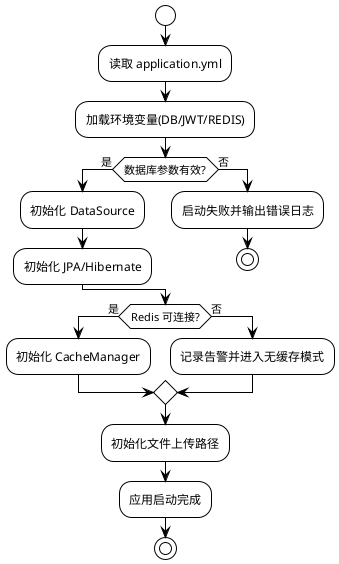
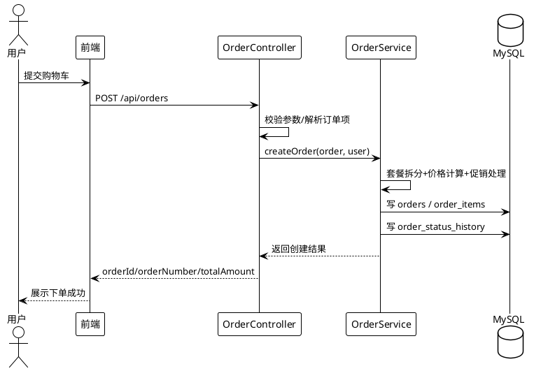
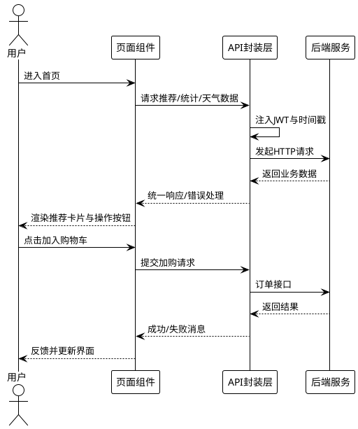

# 第四章 系统实现

## 4.1 开发环境与工具

本章在第三章“系统分析与设计”的基础上，进一步给出系统工程化落地过程，重点说明后端服务、前端交互、数据库连接、缓存机制、权限控制与关键业务链路的具体实现方式。系统实现阶段不仅关注“功能可运行”，更关注“工程可维护、流程可追踪、问题可定位、能力可扩展”。

为保证实验结果可复现，本系统在固定软硬件环境中完成开发、联调与验证。具体环境如下。

### 4.1.1 软件环境

| 类别 | 配置 |
| --- | --- |
| 操作系统 | Windows 11 专业版 |
| 后端开发工具 | IntelliJ IDEA Ultimate 2025 |
| Java 运行环境 | OpenJDK 17 |
| 后端框架 | Spring Boot 3.3.13 |
| 数据库 | MySQL 8.0.33 |
| 依赖管理 | Maven 3.8 |
| 前端开发工具 | IntelliJ IDEA Ultimate 2023 |
| 前端构建工具 | Vite 8.0.3 |
| 前端框架 | Vue 3 + Vue Router + Pinia + Element Plus |

说明：用户给出的目录中“前端构建工具”描述为 IntelliJ IDEA。工程实现中实际构建链路使用 Vite，IDEA 主要承担编码、调试与项目管理角色。因此论文写作时可保留“前端开发工具为 IDEA”，并将“前端构建工具为 Vite”单独注明，以保证技术描述准确。

### 4.1.2 硬件环境

| 类别 | 配置 |
| --- | --- |
| 处理器（CPU） | 13th Gen Intel Core i9-13900H @ 2.60GHz |
| 图形处理器（GPU） | NVIDIA GeForce RTX 4060 Laptop GPU |
| 内存（RAM） | 48GB DDR5 |
| 存储 | 2TB NVMe SSD |

### 4.1.3 运行环境选型说明

本系统选用 Java 17 + Spring Boot 3.3.x，是因为该组合在企业级应用中具备稳定生态、清晰分层与成熟安全体系，适合订单交易与权限控制等高可靠场景。数据库采用 MySQL 8.0.33，既能支撑事务一致性，也便于后续通过索引优化与统计查询扩展分析能力。前端选择 Vue 3 + Vite，兼顾开发效率与页面响应速度。Element Plus 与 ECharts 的组合可在不牺牲交互体验的前提下快速构建管理端数据可视化页面。

与原型系统相比，当前工程化实现增加了 JWT 鉴权、Redis 缓存、订单状态历史追踪、支付回调签名校验、统计指标服务化输出等能力，使系统从“功能原型”升级为“可运行、可维护、可扩展”的应用形态。

---

## 4.2 数据库连接与配置实现

数据库连接与配置是后端服务运行的前提。本系统在 `application.yml` 中采用“环境变量优先、默认值兜底”的配置策略，兼顾本地开发便利性与部署安全性。核心实现如下。

### 4.2.1 数据源连接配置

系统通过 Spring Boot 标准数据源完成 MySQL 连接，核心字段包括数据库 URL、用户名、密码与驱动。配置中使用 `${}` 语法支持环境变量覆盖，例如 `DB_URL`、`DB_USERNAME`、`DB_PASSWORD`。该方式的优势在于：

1. 本地环境可直接使用默认值快速启动；
2. 测试与生产环境可通过环境变量注入敏感信息，避免硬编码；
3. 同一套代码可在不同环境平滑迁移，降低部署改造成本。

数据库 URL 中显式指定 `useUnicode=true`、`characterEncoding=utf8`、`serverTimezone=Asia/Shanghai`，用于避免中文乱码与时区偏差导致的数据展示异常。

### 4.2.2 JPA 与 Hibernate 配置实现

系统采用 Spring Data JPA 管理 ORM 映射，`ddl-auto` 与 `hbm2ddl.auto` 设为 `update`，便于开发阶段快速同步实体结构。`show-sql` 和 `format_sql` 打开后，开发者可直接在日志中观察 SQL 执行情况，便于定位慢查询与字段映射问题。

为兼顾开发效率与对象序列化稳定性，项目保留 `open-in-view: true`。同时在 Jackson 配置与缓存序列化层面补充对 Hibernate 延迟加载对象的处理，避免在返回 JSON 时出现代理对象序列化异常。

### 4.2.3 Redis 缓存连接与序列化配置

系统在推荐与统计等读多写少场景引入 Redis 缓存。连接参数同样支持环境变量注入，包含主机、端口、密码、库号与超时时间。

缓存配置的关键点在于序列化策略：

1. Key 使用 `StringRedisSerializer`，确保可读性；
2. Value 使用 `GenericJackson2JsonRedisSerializer`，避免 JDK 序列化的体积与兼容性问题；
3. 基于复制后的 `ObjectMapper` 启用类型信息，解决反序列化为 `LinkedHashMap` 的问题；
4. 默认 TTL 设为 1 小时，并关闭 null 值缓存，兼顾命中率与数据新鲜度。

该配置使推荐结果缓存既可稳定反序列化，又不容易因实体结构升级导致不可读问题。

### 4.2.4 文件上传与静态资源配置

系统支持菜品图片上传。后端通过 `spring.servlet.multipart` 限制单文件与总请求体积（5MB/30MB），避免超大文件对接口造成冲击。上传目录由 `FILE_UPLOAD_DIR` 控制，默认路径为 `C:/canteen/uploads`。在资源映射配置中，系统对 `/uploads/**` 提供公开访问能力，前端可直接通过 URL 渲染图片。

### 4.2.5 配置安全与运行保障

系统将 JWT 密钥、支付回调密钥等敏感配置统一放入环境变量，避免凭据泄露到版本库。日志级别采用“业务 INFO、框架 WARN/ERROR”的组合，既保留故障定位信息，又避免日志噪声过高。

数据库连接层的工程实践总结为三点：一是配置解耦（环境变量化）；二是可观察（SQL 与日志可追踪）；三是可降级（缓存失效时回落数据库，保证核心业务可用）。

### 4.2.6 环境初始化与联调实现细节

为降低“本地能跑、换机失效”的问题，系统在初始化阶段形成了标准化联调步骤：

1. **导入数据库结构与基础数据**：执行 `canteen_recommendation.sql`，确保核心表与样例数据齐备；
2. **检查后端配置**：确认 `DB_URL`、`DB_USERNAME`、`DB_PASSWORD`、`JWT_SECRET` 等环境变量可用；
3. **启动后端服务**：通过 Maven 启动 Spring Boot，确认端口 `8089` 正常监听；
4. **启动前端服务**：通过 Vite 启动开发服务器，确认跨域请求可正常访问后端；
5. **验证链路连通性**：调用登录、推荐、下单、统计接口做最小闭环验证。

在联调阶段，项目额外提供了数据库连通测试接口用于快速排错。当出现“登录失败但接口可达”时，可区分是认证问题还是数据连接问题，减少排错时间。该流程在多人协作和跨设备迁移场景下尤为重要。

**图4-1 数据库连接与配置初始化流程（PlantUML）**

---

## 4.3 后端核心功能实现

后端实现遵循 Controller- Service-Repository 三层结构，核心能力可归纳为认证授权、智能推荐、订单交易、支付回调、统计分析与通知推送六个部分。以下结合关键实现逻辑展开说明。

### 4.3.1 认证与授权实现

系统采用“JWT + Spring Security 过滤链”实现无状态认证：

1. 用户登录后由 `JwtUtils` 生成 token，载荷中包含 `userId`、`username`、`role`；
2. 请求到达后由 `JwtAuthenticationFilter` 解析 `Authorization: Bearer <token>`；
3. 若 token 有效，则将认证信息写入 `SecurityContext`；
4. `SecurityConfig` 根据接口路径与 HTTP 方法做访问控制。

权限模型采用 RBAC 思路：

- 公开接口：登录、注册、部分只读菜品与推荐接口；
- 普通认证接口：订单、支付、用户信息、统计查询；
- 管理权限接口：菜品写操作、窗口管理、活动管理、后台管理路径。

该方案的工程价值在于：一方面减少 Session 依赖，便于前后端分离；另一方面通过路径规则与角色规则并行，控制粒度更细。

### 4.3.2 推荐服务实现

推荐模块以 `RecommendationServiceImpl` 为核心，支持策略注册与组合调用。系统采用策略模式管理多种推荐方法，包括热门策略、协同过滤策略、内容策略、发现策略、健康目标策略等。

推荐流程实现要点：

1. **输入校验**：用户 ID 与 limit 参数先做安全约束；
2. **多策略召回**：按模式组合协同过滤、内容匹配与热门兜底；
3. **去重与补齐**：候选不足时自动补齐，保证返回数量稳定；
4. **推荐理由输出**：返回结构中附带 reason 字段，提升可解释性；
5. **缓存加速**：如“今日上新”接口使用缓存注解减少重复查询。

系统在推荐失败时不会直接报错给用户，而是自动回退到热门策略。该“服务降级”机制有效提升了高峰期稳定性和页面可用性。

### 4.3.3 订单创建与状态流转实现

订单模块是系统最核心的交易能力。`OrderController` 负责请求解析，`OrderServiceImpl` 负责业务规则与事务执行。实现中重点处理了以下复杂场景。

1. **多类型订单项解析**：同时支持单品与套餐下单；
2. **套餐拆分计价**：将套餐拆分到具体菜品并按比例分摊金额；
3. **促销与赠品兼容**：赠品强制零价，促销价与原价并行保留；
4. **库存与状态校验**：下单前校验菜品状态，避免售罄菜品继续下单；
5. **状态历史记录**：每次状态变更写入 `order_status_history`，支持追溯；
6. **权限隔离**：普通用户只能操作自己的订单，管理员/窗口管理员可处理运营订单。

从工程实现看，订单模块采用“严格校验 + 明确错误反馈”的设计原则。当订单项存在异常时，接口返回可读错误信息，而不是笼统失败，便于前端直接提示用户修正。

**图4-2 订单创建与状态流转时序图（PlantUML）**

### 4.3.4 支付回调与签名校验实现

支付模块采用“双入口”机制：

1. 内部模拟支付成功接口（登录态）；
2. 第三方回调接口（公开路径，但要求签名验证）。

在支付回调中，系统通过 `HmacSHA256` 校验签名，签名载荷由 `orderNumber|paymentMethod|transactionId|timestamp` 构成，并限制时间窗口，避免重放攻击。校验通过后，调用订单服务更新支付状态与支付信息。

该实现的优势是：即使回调接口是公开入口，仍通过“签名 + 时间戳 + 密钥”确保来源可信，降低伪造请求风险。

### 4.3.5 统计分析服务实现

统计服务由 `StatisticsService` 提供，采用 `JdbcTemplate` 执行聚合 SQL，并通过统一时间窗口逻辑输出指标。相比全量 ORM 查询，直接聚合 SQL 在复杂报表场景更可控。

实现特点包括：

1. 指标口径统一（有效订单状态统一定义）；
2. 当前周期与上一周期对比，自动计算变化率；
3. 支持按食堂、窗口等维度过滤；
4. 支持关键词分析、词云、异常检测等扩展分析能力；
5. 部分计算结果可缓存，减轻高频查询压力。

统计模块的实现价值在于把“运营经验”转化为“可量化指标”，为推荐优化与管理决策提供数据依据。

### 4.3.6 天气与情景服务实现

为增强情景推荐效果，系统引入天气服务。`WeatherServiceImpl` 优先请求 Open-Meteo 实时天气，若外部接口超时或异常，则降级为本地随机兜底数据。该策略确保前端“情景推荐”区域始终有可展示上下文，不因外部依赖异常导致页面空白。

该实现体现了“外部依赖可失败，但核心业务不可中断”的工程原则。

### 4.3.7 接口规范与异常处理实现

后端接口在实现中统一遵循“参数校验前置、业务异常可解释、系统异常可追踪”的规则。具体策略如下：

1. **参数校验前置**：Controller 层对必要参数、枚举值、时间格式进行校验，避免无效请求进入深层业务逻辑；
2. **业务异常显式返回**：如用户不存在、密码错误、权限不足、菜品下架、库存不足等，返回明确错误码与错误信息；
3. **系统异常兜底处理**：捕获不可预期异常并记录日志，返回统一错误响应，防止堆栈信息泄露；
4. **权限异常统一处理**：401 与 403 分离，保证前端可以做差异化交互提示；
5. **链路日志可定位**：关键接口在请求入口、关键决策点、失败出口记录日志，方便复盘。

该规范化策略显著降低了联调成本。前端不再需要针对每个接口单独猜测错误语义，而是可基于统一约定完成交互处理。

### 4.3.8 代码组织与可维护性实现

系统后端在工程组织层面采用“按业务域拆分 + 公共能力沉淀”的方式：

1. `controller` 包承载 HTTP 入口，负责参数映射、权限注解与响应格式；
2. `service` 包承载核心业务，聚焦规则编排、事务控制、降级策略；
3. `repository` 包承载持久层访问，减少 SQL 逻辑与业务逻辑耦合；
4. `config` 包集中管理安全、缓存、序列化、静态资源等框架配置；
5. `util` 包提供通用工具，如安全上下文读取、关键词处理等。

这种组织方式在毕业设计后期迭代中优势明显：新增功能时只需在对应业务域扩展，不必改动大量无关代码，有利于持续演进。

---

## 4.4 前端关键交互实现

前端采用 Vue 3 组合式 API 与组件化开发方式，通过 API 层、状态层、路由层、页面层分工实现可维护交互。其重点不只是页面展示，而是“用户行为与后端能力之间的稳定契合”。

### 4.4.1 API 请求封装与错误治理

项目在 `src/api/index.js` 中统一封装 Axios 实例，配置基础地址、超时时间、跨域凭据与 JSON 头。请求拦截器自动注入 token，并为 GET 请求附加时间戳参数以规避缓存；响应拦截器按状态码统一错误提示，并在 401 时清理登录态并重定向登录页。

该设计的直接收益：

1. 页面层无需重复处理 token 透传；
2. 网络异常提示一致，降低交互割裂感；
3. 身份失效可自动回收状态，减少“假登录”问题。

### 4.4.2 路由守卫与前端权限控制

系统在 `router/index.js` 中定义了用户端与管理端路由树，并使用 `meta.requiresAuth`、`meta.requiresAdmin`、`allowedRoles` 组合进行导航守卫。访问管理端页面时，先检查 token，再检查角色与页面允许角色，最终决定放行或重定向。

该机制虽然不能替代后端鉴权，但能显著减少越权页面误访问，提升交互安全与可用性。

### 4.4.3 用户状态与本地会话管理

系统通过 Pinia 用户仓库存储 `userInfo`、`token`、`isLoggedIn`，并同步到 `localStorage`。登录成功后持久化必要字段，退出登录时清理 token、用户信息与购物车缓存，防止账号切换后的数据污染。

这种“内存状态 + 本地持久化”的组合保证了刷新后会话可恢复，同时避免页面之间重复拉取基础用户信息。

### 4.4.4 首页智能交互实现

首页是本系统用户价值最集中的页面。`Home.vue` 通过组件组合实现了以下关键区域：

1. **通知栏**：展示系统公告与活动信息；
2. **数据看板**：展示用户偏好与健康建议；
3. **情景智能推荐**：融合时间、天气、季节上下文；
4. **今日上新、猜你喜欢、个性化热门**：多策略推荐并行展示；
5. **健康目标推荐**：展示目标匹配度与营养信息。

在交互细节上，页面使用骨架加载/加载状态、空态提示、可用性按钮（如“已售罄”禁用）等方式提升可理解性。推荐卡片支持“查看详情 + 加入购物车”双通道操作，缩短转化路径。

### 4.4.5 情景推荐组件实现

`SmartRecommend.vue` 是前端差异化交互的核心组件。它通过本地时间判断时段、通过日期判断季节、通过地理定位+天气接口获取气象上下文，并将上下文信息与推荐结果共同展示。组件还内置“换一批”刷新逻辑，提升推荐探索性。

该组件的实现特点：

1. 上下文信息与推荐结果同屏展示，降低“推荐黑盒感”；
2. 对天气接口失败做默认降级，避免模块空白；
3. 统一菜品格式化逻辑，兼容后端字段差异。

### 4.4.6 管理端可视化交互实现

管理端在 `Admin` 子路由下组织数据看板、菜品管理、订单管理、评价管理、活动管理等页面。统计类页面通过 ECharts 与词云组件呈现趋势、排行与关键词分布，帮助运营人员从“看数据”转向“用数据”。

管理端交互强调两个能力：

1. **快速定位**：支持时间范围、食堂、窗口等条件筛选；
2. **可执行闭环**：看板发现问题后，可直接切换到菜品、订单、活动页面执行调整。

### 4.4.7 交互细节优化与体验治理

在功能可用之外，前端还对多处细节做了体验优化：

1. **加载状态治理**：列表、看板、推荐模块均提供 `loading` 状态，避免用户误判页面卡死；
2. **空态治理**：对无数据场景提供清晰占位和提示语，避免“白屏式失败”；
3. **状态禁用治理**：对于售罄菜品、无权限操作按钮采用禁用态，降低误操作；
4. **错误提示治理**：通过统一消息组件反馈错误来源，减少“失败但无提示”的交互断点；
5. **移动端适配治理**：推荐卡片在不同断点自动布局，保证手机与桌面端均可阅读与操作；
6. **数据格式治理**：前端对后端返回字段做格式化适配，避免字段差异直接污染 UI。

通过上述优化，系统从“能用”提升为“好用”。尤其是在校园高峰时段，页面反馈速度与操作可预期性对用户满意度影响显著。

### 4.4.8 前后端联调中的契约实现

系统在联调阶段采用“接口先约定、页面后对接”的契约式实践：

1. 后端先确定路径、方法、参数与响应结构；
2. 前端基于 API 模块统一封装调用方法；
3. 双方围绕错误码、分页字段、时间格式建立一致规范；
4. 在关键链路（登录、推荐、下单、统计）进行回归联调。

该实践有效减少了“字段变更导致全局页面报错”的问题，特别适用于本项目这种多页面、多角色、多接口并行开发的场景。

**图4-3 前端关键交互流程（PlantUML）**

---

## 4.5 系统难点与解决方案

在系统实现过程中，工程难点主要集中在“业务复杂度高、数据链路长、前后端协同边界多”三个方面。以下列出典型问题与解决策略。

### 4.5.1 难点一：推荐结果稳定性与个性化深度的平衡

**问题表现**：纯个性化策略在冷启动或样本不足时容易返回空结果或质量不稳定；纯热门策略又缺乏个体差异。

**解决方案**：采用多策略融合与兜底机制。优先返回个性化结果，不足部分由热门策略补齐；推荐异常时统一回退热门列表，同时保留推荐理由字段。

**效果**：推荐接口在各用户阶段都能稳定输出，页面无“空推荐”问题，且个性化程度随行为数据积累逐步增强。

### 4.5.2 难点二：套餐、促销、赠品并存下的订单计价复杂性

**问题表现**：订单既可能包含单品，也可能包含套餐；套餐需拆分到菜品明细，且要兼容促销与赠品逻辑。若处理不当，易出现金额不一致。

**解决方案**：在订单服务中先做套餐拆分，再进行价格分摊和促销计算；赠品强制零价；明细表保存下单时价格快照。

**效果**：订单金额可追溯、可对账，降低后续售后争议和财务核对成本。

### 4.5.3 难点三：权限模型在前后端双端一致性

**问题表现**：仅依赖前端路由控制会存在绕过风险；仅依赖后端权限会导致用户频繁进入后才被拒绝，体验较差。

**解决方案**：前端路由守卫做访问前拦截，后端 Security 规则做最终鉴权，形成“前置友好 + 后置强校验”的双层模型。

**效果**：越权访问明显减少，权限错误提示更早、更清晰，系统安全性与可用性同时提升。

### 4.5.4 难点四：Hibernate 延迟加载对象的序列化异常

**问题表现**：实体对象在缓存或接口输出时，可能因延迟加载代理导致序列化失败或结构异常。

**解决方案**：在 Jackson 与 Redis 缓存层统一配置对象映射规则，注册 Hibernate 模块并关闭空 Bean 失败策略。

**效果**：接口输出和缓存反序列化稳定，减少线上偶发序列化错误。

### 4.5.5 难点五：外部天气服务不稳定对情景推荐的影响

**问题表现**：外部 API 可能超时、失败或返回异常字段，导致情景推荐无法展示。

**解决方案**：天气服务设置短超时并增加降级数据，失败时返回本地可用默认值。

**效果**：情景推荐组件在依赖异常时仍可工作，用户端体验连续性更好。

### 4.5.6 难点六：支付回调接口公开带来的安全风险

**问题表现**：回调接口通常需要对外开放，若无校验容易被伪造请求攻击。

**解决方案**：采用 HMAC-SHA256 签名校验 + 时间戳窗口校验 + 回调密钥环境变量化管理。

**效果**：回调请求来源可验证，重放攻击风险明显降低。

### 4.5.7 难点七：统计分析性能与实时性的平衡

**问题表现**：管理端图表查询多、聚合复杂，直接实时统计可能影响交易接口性能。

**解决方案**：核心统计采用聚合 SQL 与必要缓存，部分指标沉淀至日统计表；将高成本分析与交易链路解耦。

**效果**：管理端分析响应可控，主交易链路稳定性不受明显影响。

### 4.5.8 难点八：前后端字段语义不一致

**问题表现**：在多轮迭代后，后端返回字段可能同时存在 `image` 与 `imageUrl`、`status` 与 `available` 等表达方式，若前端直接绑定容易出现显示错乱。

**解决方案**：在前端组件层增加统一格式化函数，对价格、状态、图片、分类等字段做标准化转换，再进入渲染逻辑。

**效果**：页面渲染稳定性提升，接口小范围调整不再导致大面积 UI 变更。

### 4.5.9 难点九：高峰期排错复杂度高

**问题表现**：高峰期同时出现推荐请求、下单请求、统计请求，若无分层日志与关键节点打点，故障定位时间长。

**解决方案**：对关键服务添加分层日志（请求入口、策略分支、失败出口），并在支付、订单、推荐等关键链路保留可追踪字段。

**效果**：出现异常时可快速定位是认证问题、数据问题还是外部依赖问题，缩短故障恢复时间。

通过上述难点治理，系统在功能完整性、稳定性、安全性和可维护性方面均达到毕业设计工程实现要求。

---

## 4.7 本章小结

本章围绕系统实现给出了从环境配置到功能落地的完整说明。首先，明确了软件与硬件环境，保证系统实现过程可复现；其次，详细说明了数据库、JPA、缓存、文件上传与安全参数的配置策略，确保系统具备稳定运行基础；再次，针对认证授权、推荐服务、订单交易、支付回调、统计分析与情景服务等后端核心模块给出了实现路径；随后，从 API 封装、路由守卫、状态管理、首页推荐交互与管理端可视化等角度阐述了前端关键交互实现；最后，对开发过程中最关键的工程难点进行了归纳，并给出可验证的解决方案。

综合来看，本系统实现并非仅完成了“功能点拼接”，而是形成了“可运行、可追踪、可优化”的工程化闭环：推荐能力可迭代、交易链路可审计、权限模型可控、统计结果可决策。该实现结果为下一章系统测试提供了完整对象与验证基础，也为后续性能优化和算法升级预留了明确扩展空间。
